# Hi there !!  

```c
#include<stdio.h>

int main()
{
  char *Name = "Aravindhan S";
  char *Titles[] = {"Computer Science Student", "Tech Enthusiast"};
  char *AboutMe[] = {
        "Computer Science Student in CEG",
        "Active in Tech Communities",
        "Open Source Contributor",
        "Continuous Learner"
    };
  char *Languages[] = {"C/C++", "Java", "Python", "JavaScript", "SQL"};
  char *WebDevelopment[] = {"MERN", "Flask", "React.js", "Express.js"};
  char *Databases[] = {"MySQL", "SQLite","MongoDB"};
  char *ToolsAndPlatforms[] = {"Git", "GitHub", "VS Code", "Jupyter Notebook", "Vercel"};
  char *AreasOfInterest[] = {"Full-Stack Development", "AI/ML", "Blockchain", "Open Source"};
  return 0;
}
```

## Featured Projects 

&nbsp;&nbsp;&nbsp;&nbsp;&nbsp;&nbsp;&nbsp;&nbsp;&nbsp;
 

## GitHub Stats  
&nbsp;&nbsp;&nbsp;&nbsp;&nbsp;&nbsp;&nbsp;&nbsp;&nbsp;


## Connect with Me  
- [LinkedIn](https://www.linkedin.com/in/aravindhan-ks/)  
<!-- - 💻 [Portfolio](#)  --> 
